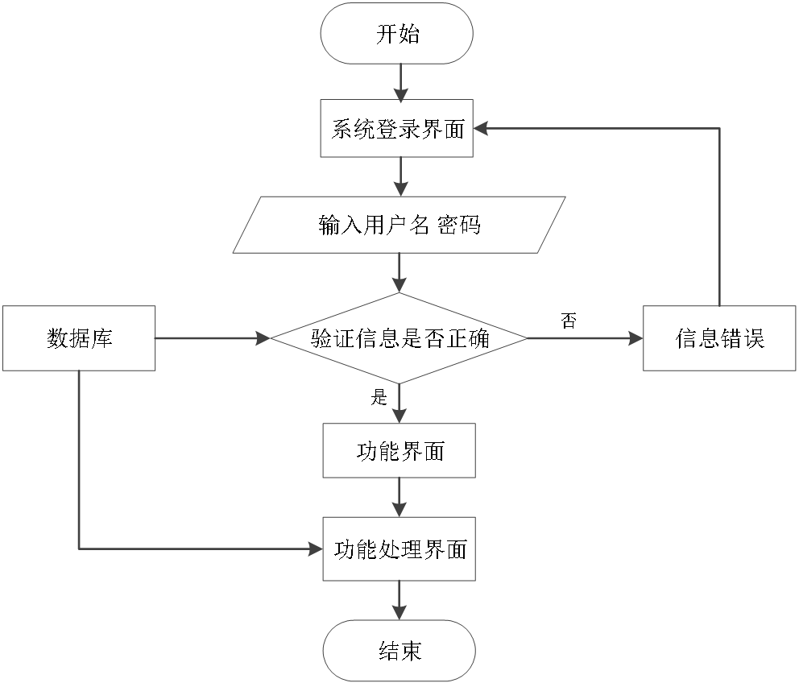

# springboot189-基于SpringBoot的校园疫情防控系统

>  博主介绍：
>  Hey，我是程序员Chaers，一个专注于计算机领域的程序员
>  十年大厂程序员全栈开发‍ 日常分享项目经验 解决技术难题与技术推荐 承接各类网站设计，小程序开发，毕设等。
>  【计算机专业课程设计，毕业设计项目，Java，微信小程序，安卓APP都可以做，不仅仅是计算机专业，其它专业都可以】

## 本项目获取地址：https://www.bishecode.com/product/186/

## 3000套系统可挑选，获取链接：https://www.bishecode.com/

### 系统架构

> 前端：html | js | css | jquery | vue
>
> 后端：springboot | mybatis
> 
> 环境：jdk1.8+ | mysql | maven

# 一、内容包括
包括有  项目源码+项目论文+数据库源码+答辩ppt+远程调试成功

# 二、运行环境

> jdk版本：1.8 及以上； ide工具：IDEA； 数据库: mysql5.7及以上；编程语言: Java

# 三、需求分析

**3.1 可行性分析**

从三个不同的角度来分析，确保开发成功的前提是有可行性分析，只有进行提前分析，符合程序开发流程才不至于开发过程的中断。

**3.1.1 技术可行性**

在技术实现层次，分析了好几种技术实现方法，并且都有对应的成功案例，也有很多开源模块可以进行参考，所以从技术可行性分析来讲，实现校园疫情防控系统是没有问题的。

**3.1.2 经济可行性**

对于身为学生的开发者而言，在经济资源上面可用者很少，为了开发校园疫情防控系统，通过开发软件对硬件的要求，发现自己的电脑是完全能用来开发的，并且学校机房的配置也可以达到要求。最重要的是选择的技术都可以在网上找到不花钱的教程以及资料，因为不花钱，所以经济方面是具有可行性的。

**3.1.3 操作可行性**

校园疫情防控系统的具体实现，本身参考人类的正常操作逻辑，把常用的操作习惯当做主要的导航实现，可以让使用者更快速的理解并且上手操作，实现符合逻辑的操作流程是操作可行性的具体体现。
以上就是从不同的角度来分析，确保了校园疫情防控系统的正常开展。

**3.2 系统流程**

校园疫情防控系统投入使用后，使用者如果能看到相应的流程操作图会提高程序的理解能力。
使用者在操作校园疫情防控系统中，应该按照本系统提供的操作流程（图3.1即为本系统的操作流程图）进行操作，可以减少操作失误，从而节省进入校园疫情防控系统的时间。

# 四、功能模块

下图即为设计的管理员功能结构，管理员权限操作的功能包括查看学生的健康信息，管理聊天室信息，对教师，学生请假，学生，公告信息进行管理。

下图即为设计的教师功能结构，教师权限操作的功能包括发布聊天信息，回复聊天信息，查看学生健康信息，审核学生请假信息，查看学生信息等。

下图即为设计的学生功能结构，学生权限操作的功能包括管理聊天室的聊天信息，可以添加请假信息，查看教师对学生请假的处理结果信息，登记并管理学生自己的健康信息等。

# 五、效果图展示【部分效果图】

图5.1 教师管理界面【图5.1 即为编码实现的教师管理界面，教师信息包括教师姓名，学院，邮箱等信息，管理员对有错误数据的教师信息使用修改功能可以及时更正，需要删除的教师信息也能使用删除功能及时删除。】

图5.2 学生管理界面【图5.2 即为编码实现的学生管理界面，管理员对学生数据可以添加，也能通过文件的形式导入学生数据。学生信息出现错误，管理员也能使用修改功能及时更正。】

图5.3 公告信息管理界面【图5.3 即为编码实现的公告信息管理界面，公告的内容需要管理员添加，在公告信息管理界面，管理员也能修改公告内容。】

图5.4 健康表查看界面【图5.4 即为编码实现的健康表查看界面，健康表信息包括健康状态，体温，学生姓名等信息，教师根据健康状态或学生姓名对学生的健康信息进行查询。】

图5.5 学生请假管理界面【图5.5 即为编码实现的学生请假管理界面，学生申请请假，教师就需要在学生请假管理界面审核。学生请假信息有请假原因，请假时间，请假状态等信息。】

 <b>完整文章</b>
 
 
 

## 本项目获取地址：https://www.bishecode.com/product/186/

## 3000套系统可挑选，获取链接：https://www.bishecode.com/

